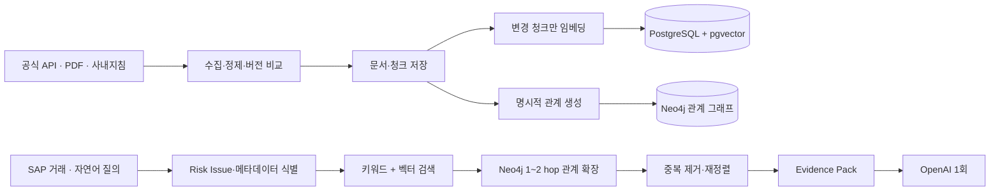

# Vector + Graph Hybrid RAG 아키텍처

## 1. 목적과 범위

이 문서는 AI 회계·세무 리스크 사전검증 PoC의 승인된 외부·내부 근거를 검색하는 구조를 정의한다. SAP 원장 분석, Risk Score 규칙, 특수관계자 Master, 담당자 최종 판단 절차는 이 문서의 변경 대상이 아니다.

핵심 원칙은 외부 원천을 수집·갱신 단계에서만 사용하고, 거래 분석·지식 챗봇·AI 검토 시에는 내부 저장소만 검색한다는 것이다. LLM은 검색기가 아니라 검증 가능한 Evidence Pack을 설명하는 최종 단계다.

## 2. 현재 구조와 목표 구조

현재 구조는 SQLite의 `documents`, `document_chunks`, `document_relations`, `chunk_relations`에 정제 원문과 명시적 참조 관계를 보관한다. 임베딩은 선택적으로 PostgreSQL `pgvector`에 저장하며, 검색은 조문·문단 정확 검색, 키워드 검색, 벡터 검색, SQLite 관계 1-hop 확장을 결합한다. AI 검토에는 근거 문서 묶음만 전달한다.

목표 구조는 원문·청크·벡터의 정합성 저장소를 PostgreSQL + pgvector로, 다단계 관계 확장과 경로 설명을 Neo4j로 담당하게 한다. SQLite는 기존 PoC와 갱신 작업의 호환을 유지하는 임시 정제 저장소이며, Neo4j 장애 시 검색은 PostgreSQL/SQLite Hybrid Search로 안전하게 축소한다.



## 3. 모듈과 인터페이스

`EvidenceRepository`는 문서·청크·버전·메타데이터를 읽고 쓰는 모듈이다. `VectorIndex`는 변경 청크만 임베딩하고 유사도 결과를 반환한다. `RelationGraph`는 청크·문서·Risk Issue의 명시적 관계를 동기화하고 최대 2-hop 후보를 반환한다. `HybridRetriever`는 이 세 모듈을 감추고 `retrieve(query, transaction, risk_issues, as_of_date, limit)` 하나의 인터페이스로 Evidence Pack 후보를 반환한다.

이 구분의 목적은 호출자가 Neo4j, pgvector, SQLite의 쿼리·장애·점수 방식을 알 필요 없게 하는 것이다. Neo4j 어댑터가 준비되지 않았거나 연결에 실패하면 `RelationGraph`는 SQLite 관계 테이블 어댑터로 동작한다.

## 4. 데이터 모델

### PostgreSQL

| 테이블 | 핵심 컬럼 | 책임 |
| --- | --- | --- |
| `documents` | id, document_type, title, source, source_url, effective_date, version, content_hash, status | 원문과 이력 |
| `document_chunks` | id, document_id, chunk_index, article_no, section, paragraph_no, text, content_hash, metadata | 검색 최소 단위 |
| `knowledge_embeddings` | chunk_id, embedding_model, embedding, content_hash, created_at | pgvector HNSW 검색 |
| `document_relations` | source_id, target_id, relation_type, confidence, source, source_text, extraction_method | 검증 가능한 관계 원장 |
| `risk_issues` | code, name, description, active | PRD 쟁점 코드 |
| `risk_issue_relations` | risk_issue_code, target_id, relation_type, confidence | Risk Issue와 근거 연결 |
| `retrieval_logs` | query_hash, analysis_id, retrieved_ids, scores, route, created_at | 품질·재현성 점검 |

기존 SQLite `document_chunks`와 `chunk_relations`는 위 모델과 동일한 식별자를 유지해 전환 중에도 검색 결과의 출처를 보존한다.

### Neo4j

노드는 `Document`, `Chunk`, `RiskIssue` 세 종류부터 시작한다. `Document`에는 `document_type`, `title`, `effective_date`, `version`, `status`를, `Chunk`에는 `chunk_id`, `article_no`, `paragraph_no`, `section`을 둔다. 문서 유형은 Law, EnforcementDecree, EnforcementRule, Interpretation, TaxRuling, CaseLaw, AccountingStandard, InternalPolicy, ReviewCase로 메타데이터에 구분한다.

관계는 `HAS_CHUNK`, `HAS_DECREE`, `HAS_RULE`, `INTERPRETED_BY`, `CITED_BY`, `RELATED_TO`, `APPLIES_TO`, `SUPERSEDES`, `AMENDS`, `BASED_ON`, `RELATED_RISK`를 사용한다. 모든 관계에는 `confidence`, `source`, `source_text`, `extraction_method`, `created_at`를 저장한다.

## 5. 수집·증분 갱신

1. 공식 API·PDF·사내지침에서 원문과 출처·시행일·버전을 수집한다.
2. 문서 식별자, 시행일/변경일, `content_hash`를 비교한다.
3. 변경이 없으면 원문·청크·임베딩·관계를 재생성하지 않는다.
4. 신규 또는 변경 문서는 조문, 문단, 페이지 단위 청크로 정제한다.
5. `content_hash`가 달라진 청크만 임베딩을 생성하고 pgvector를 upsert한다.
6. 공식 조문 참조, 법령 구조, 판례·예규의 인용 조문, 문서 메타데이터 순으로 결정적 관계를 생성한다.
7. 관계 원장과 Neo4j를 같은 식별자로 동기화한다. 폐지 문서는 삭제하지 않고 historical 상태로 둔다.

거래 발생일이 제공되면 검색 시 해당 날짜에 유효한 버전을 우선하고, 현행 조문과 다르면 그 차이를 Evidence Pack에 표시한다.

## 6. Hybrid Retrieval과 재정렬

1. 질문과 거래에서 세무·회계·복합 트랙, Risk Issue, 조문·문단·기간·법인 구분을 식별한다.
2. 메타데이터 필터를 적용한 조문·문단 정확 검색과 PostgreSQL 전문 검색을 수행한다.
3. 질의 임베딩은 한 번 생성해 pgvector Top-K를 얻는다.
4. 초기 후보의 청크/문서/Risk Issue에서 Neo4j를 최대 2-hop 확장한다. 기본은 명시적·신뢰도 높은 관계만 허용한다.
5. 정확 일치, 키워드, 벡터 유사도, 관계 신뢰도, 문서 유형 우선순위, 유효기간을 결합해 중복 제거·재정렬한다.
6. 법령 조문을 우선하고, 사실관계가 유사한 유권해석·판례는 보강 근거로만 넣는다.

회계 질문은 K-IFRS·일반기업회계기준·회계지침을 우선하고, 세무 질문은 법령·시행령·시행규칙·유권해석·판례·세무지침을 우선한다. 복합 질문은 두 트랙의 상위 근거를 균형 있게 포함한다.

## 7. Evidence Pack

```json
{
  "transaction": {},
  "risk_result": {"risk_score": 0, "risk_issues": ["R02"]},
  "evidence": [{"document_id": "", "chunk_id": "", "document_type": "LAW", "title": "", "article": "", "text": "", "effective_date": "", "version": "", "source_url": "", "retrieval_score": 0.0}],
  "graph_relations": [{"source": "", "relation": "", "target": "", "confidence": 1.0}],
  "past_review_cases": []
}
```

OpenAI에는 이 Pack과 사용자 제공 사실만 전달한다. Pack 밖의 법령·판례·기준서를 사실처럼 인용하지 못하게 문서 ID 검증을 적용한다. 거래별 AI 검토의 기본은 최종 OpenAI 호출 1회다.

## 8. Neo4j 도입 순서와 운영 원칙

1단계는 Neo4j 드라이버·환경설정·스키마 제약조건·SQLite 관계 동기화·상태 확인이다. 2단계는 명시적 관계의 1-hop 읽기와 SQLite fallback이다. 3단계는 Risk Issue 관계 및 최대 2-hop 확장, retrieval log, 점수 평가다. 그래프에서 추출한 후보는 항상 원문 청크를 다시 확인한 뒤 Evidence Pack에 넣는다.

Neo4j URI·계정·비밀번호는 `.env`에서만 읽는다. Neo4j 연결 정보가 없거나 장애가 발생해도 기존 검색과 AI 검토는 중단하지 않는다. 그래프 동기화는 데이터 갱신 직후에만 실행하며 질문마다 외부 API나 그래프 쓰기를 수행하지 않는다.

## 9. 검증 기준

- 같은 문서 버전을 다시 갱신할 때 임베딩 호출 수가 0인지 확인한다.
- 법인세법 제52조에서 시행령 제88조, 관련 해석·판례로의 관계 확장 결과를 검증한다.
- 회계 문단 인용 시 기준서명·문단·페이지를, 세무 인용 시 법령명·조문을 표시하는지 확인한다.
- Neo4j 연결이 없는 상태에서도 기존 Hybrid Search가 동일하게 동작하는지 확인한다.
- 검색 로그로 정확도, 근거 누락, 응답 지연, OpenAI 호출 횟수를 점검한다.
