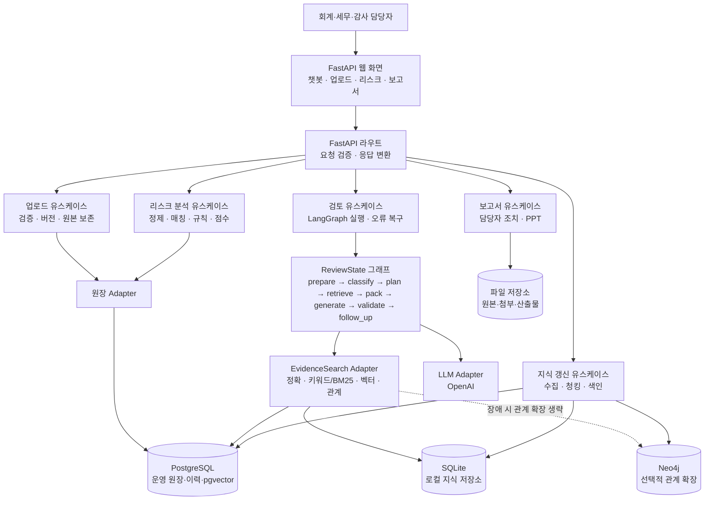

# AI 회계·세무 리스크 사전검증 시스템 아키텍처

이 문서는 `prd.md` v2를 기준으로 한 목표 아키텍처와 현재 구현의 위치를 정의한다. SAP 직접 연계는 범위에 포함하지 않으며, SAP 원장과 특수관계자 Master는 파일 업로드로 입력한다.

## 1. 설계 방향

- AI는 근거를 찾아 적용 논리를 제시하고, 최종 회계·세무 판단은 담당자가 확정한다.
- 질의 경로에서는 승인된 로컬 색인을 우선 사용한다. 외부 원천 갱신은 별도 작업으로만 수행한다.
- Risk Score는 명시적 규칙 엔진이 계산하며 AI가 변경하지 않는다.
- 모든 생성 답변과 PPT는 검증된 `evidence_id`만 인용한다.
- 구현은 하나의 Python 파일을 유지하되, 파일 내부를 논리적 모듈 영역으로 나누어 각 영역의 인터페이스를 분명히 한다.
- 데이터·검색·AI가 실패해도 가능한 범위의 잠정 답변과 추가 확인사항을 반환한다.

## 2. 논리 아키텍처



## 3. 외부 인터페이스

라우트는 업무 유스케이스를 호출하고, 저장소나 LLM의 세부사항을 직접 알지 않는다.

| 인터페이스 | 입력 | 출력 | 보장사항 |
|---|---|---|---|
| `POST /knowledge-chat` | 질문·최근 대화·첨부·모드 | 구조화된 답변·근거·후속질문·trace | 검색된 근거만 인용 |
| `POST /ai-review/with-auto-evidence` | 거래 사실·쟁점·첨부 | 전문가 검토 의견 | 근거 묶음 밖 인용 차단 |
| `POST /risk-score/preview` | 원장 행·특수관계자 목록·기준월 | 후보·규칙별 점수 | AI가 점수에 개입하지 않음 |
| `POST /risk-score/analyze-and-save` | 분석 실행 입력 | 실행 ID·저장 결과 | 원본과 분석 버전 연결 |
| `POST /expected-transaction/diagnose` | 예상 거래 사실 | 사전진단·근거·추가자료 | 이력 부족 시 점수 산정 보류 |
| `POST /knowledge-chat/report-pptx` | 검증된 검토 의견 | PPT 파일 | 의견에 없는 내용 추가 금지 |
| `GET /health` | 없음 | 구성요소 상태 | 장애를 숨기지 않고 상태 표시 |

## 4. ReviewState와 그래프 계약

그래프는 하나의 구조화된 `ReviewState`를 전달한다. 원문 첨부와 질문 전체는 상태·로그에 반복 저장하지 않고, 필요한 사실·해시·문서 ID만 보존한다.

```text
ReviewState
├─ question, conversation, attachments
├─ knowledge_track: accounting | tax | composite
├─ review_mode: simple | expert | company_specialized
├─ transaction, foundation_analysis
├─ retrieval_plan, evidence_result, evidence_pack
├─ answer, validation, follow_up_questions
├─ workflow_trace, errors
└─ retrieval_id, as_of_date
```

노드별 책임은 다음과 같다.

1. `prepare`: 사용자 입력에서 확인 사실·미확인 사실·첨부 사실을 분리한다.
2. `classify`: 회계·세무 트랙과 기초개념을 분류한다. 기준서 번호는 검색 결과 없이 만들지 않는다.
3. `plan_retrieval`: 검색어·필터·누락 사실을 만든다. LLM 실패 시 휴리스틱으로 대체한다.
4. `retrieve`: 정확 검색, 키워드/BM25, 벡터 검색, 관계 확장, 중복 제거, 재정렬을 수행한다.
5. `evidence_pack`: 직접 근거·보조 근거·인접 문맥을 구분해 LLM 입력을 최소화한다.
6. `generate`: 답변 JSON 또는 전문가 검토 JSON을 생성한다.
7. `validate`: 형식, 주장-근거 연결, 시행일·문단 metadata, 허용된 결론 상태를 검증한다.
8. `follow_up`: 결론을 바꿀 수 있는 질문만 최대 3개 만든다.
9. `company_specialize`: 사용자가 선택한 경우에만 회사 Context를 추가해 재검토한다.

## 5. 깊은 모듈과 Seam

복잡한 동작은 다음 인터페이스 뒤에 둔다. FastAPI 라우트와 그래프 노드는 이 인터페이스만 사용한다.

```text
EvidenceSearch.search(plan, as_of_date) -> EvidenceResult
EvidenceSearch.get_document(document_id) -> EvidenceDocument
ReviewOrchestrator.run(input) -> ReviewResult
RiskAnalyzer.analyze(ledger, master, analysis_period) -> RiskAnalysis
KnowledgeRefresh.refresh(scope) -> RefreshResult
ReportGenerator.create(review_result) -> ReportArtifact
```

- `EvidenceSearch`는 SQLite 로컬 검색, PostgreSQL pgvector 검색, Neo4j 관계 확장을 내부에서 조합한다.
- `ReviewOrchestrator`는 노드 순서, timeout, 재시도, fallback, trace를 소유한다.
- `RiskAnalyzer`는 반복성·특수관계자·고액·변동성 규칙과 점수표를 소유한다.
- `KnowledgeRefresh`는 외부 API·PDF·수동 업로드를 승인 문서로 정규화한 뒤 색인한다.
- `ReportGenerator`는 검증된 결과만 입력으로 받고, 미확인 정보는 `추가 확인 필요`로 표시한다.

두 구현이 실제로 필요해질 때만 Adapter seam을 확장한다. 예를 들어 로컬 SQLite와 운영 PostgreSQL은 동일한 검색 인터페이스를 만족해야 하며, Neo4j 장애 시 관계 확장만 생략하고 기본 검색은 계속한다.

## 6. 데이터 소유권과 버전

| 데이터 | 시스템 오브 레코드 | 핵심 식별자/버전 |
|---|---|---|
| 원장·분석·Risk·조치 이력 | PostgreSQL | `company_code`, `accounting_period`, `upload_version`, `analysis_id` |
| 법령·판례·기준서 원문 | SQLite(로컬) / PostgreSQL(운영 목표) | `document_id`, `source_url`, `effective_date_or_version` |
| 문서 청크·임베딩 | pgvector | `chunk_id`, `document_id`, `embedding_model` |
| 기준서·법령 관계 | Neo4j | 문서·청크 노드와 관계 경로 |
| 업로드 원본·첨부·PPT | 파일 저장소 | `analysis_id`, 파일 해시, 생성 시각 |

원본은 삭제하지 않고 업로드 버전을 추가한다. 최신 분석 기준은 명시적으로 표시하며, 검토·보고서·조치 결과는 동일한 `analysis_id`에 연결한다.

## 7. 검색 및 근거 흐름

```text
질문/거래 사실
  → 트랙·기초개념 분류
  → 검색계획
  → 문서 유형/시점 필터
  → 정확 검색 + 키워드/BM25 + 벡터 검색
  → 법령·기준서 관계 및 인접 문맥 확장
  → 중복 제거·재정렬·근거 균형
  → EvidencePack
  → 생성
  → evidence_id·문단·시행일 검증
```

검색 결과는 `document_id`, `chunk_id`, 문서명, 유형, 출처 URL, 조문·문단, 시행일·버전, 점수, 검색 방법, 관계 경로, citation용 발췌를 유지한다. 질의마다 외부 사이트를 호출하지 않으며, 공식 원천 갱신은 별도 명령으로 승인 색인에 반영한다.

## 8. 장애 복구와 보안

- LLM 분류 실패: 규칙 기반 분류·검색어 확장으로 전환한다.
- 벡터 저장소 실패: 로컬 키워드/BM25 검색으로 전환한다.
- Neo4j 실패: 관계 확장을 생략하고 기본 근거 검색을 계속한다.
- 근거 부족 또는 검증 실패: 확정 문안을 폐기하고 잠정 방향·추가 확인자료를 반환한다.
- 데이터베이스 재시작: PostgreSQL/pgvector와 Neo4j volume에서 데이터를 복구한다.
- 로그에는 질문 해시·문서 ID·점수·단계만 기록하며 API 키·첨부 원문·SAP 원문은 기록하지 않는다.
- API 키는 `.env`에서만 읽고, 응답·화면·보고서에 노출하지 않는다.
- AI는 최종 판단, 점수 변경, 승인되지 않은 원천 검색을 수행하지 않는다.

## 9. 현재 구현과 목표 구조의 차이

현재 `app.py`에는 지식 저장·검색·원장 정제·Risk Score·AI 검토·LangGraph·FastAPI 라우트가 함께 구현되어 있다. 이는 PoC 실행에는 유리하지만 변경 영향 범위와 테스트 seam이 넓다.

목표 구조에서는 파일을 여러 개로 나누지 않더라도 다음 순서로 내부 영역을 고정한다.

1. 설정·보안·공통 오류
2. 지식 저장·청킹·검색 Adapter
3. 원장·특수관계자 정제 Adapter
4. RiskAnalyzer
5. ReviewState와 LangGraph 노드
6. 보고서·PPT Adapter
7. FastAPI 라우트와 Pydantic 계약

첫 리팩터링 대상은 LangGraph 실행부를 `ReviewOrchestrator.run` 형태로 감싸는 것이다. 그 다음 근거 검색을 `EvidenceSearch`로 감싸면, 검색 품질·그래프 장애·LLM fallback을 라우트와 독립적으로 테스트할 수 있다.

## 10. 구현 우선순위

1. `ReviewState`, 노드별 입력/출력, trace와 오류 상태를 고정한다.
2. `EvidenceSearch`와 `EvidencePack`의 문서 계약을 고정하고 citation 검증을 단위 테스트한다.
3. 거래 업로드·버전·특수관계자 Master·`analysis_id` 저장 구조를 고정한다.
4. 규칙별 Risk Score와 기준선·반복거래 판정을 구현한다.
5. 전문가 검토·후속질문·회사 특화 재검토를 그래프에 연결한다.
6. 검증된 검토 결과를 PPT로 변환하고 누락정보 요청 흐름을 연결한다.
7. PostgreSQL/pgvector·Neo4j volume 재시작, 검색 fallback, 대표 benchmark를 검증한다.

## 11. 완료 판단 기준

- 회계·세무 트랙이 섞이지 않고, 복합 질의만 두 트랙을 함께 사용한다.
- 답변과 PPT에는 실제 검색된 문단·조문·버전만 표시된다.
- 근거 부족 시에도 잠정 방향과 결론 변경 요인을 제시한다.
- Risk Score의 계산 근거와 AI 검토 의견이 분리된다.
- 원본·분석·검토·조치·보고서가 하나의 실행 이력으로 추적된다.
- PostgreSQL/pgvector·Neo4j 재시작 후 데이터가 보존된다.
- 대표 벤치마크에서 검색 근거, 답변 구조, citation 연결, fallback 동작을 함께 검증한다.
